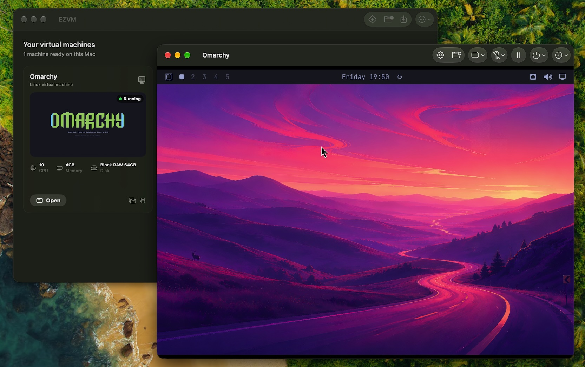
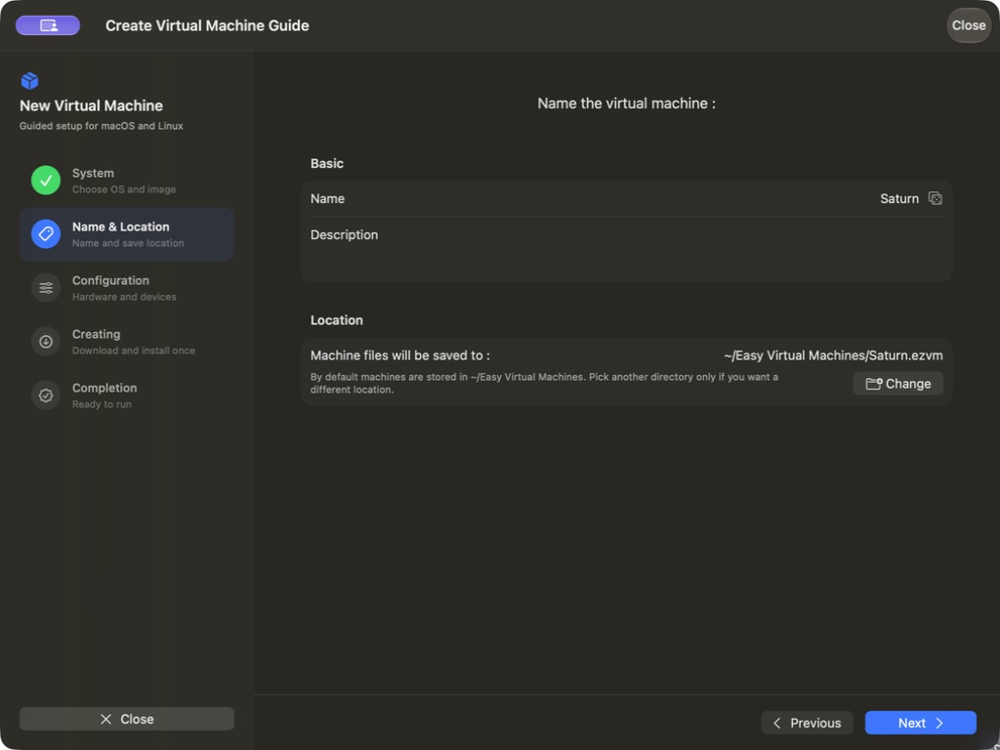
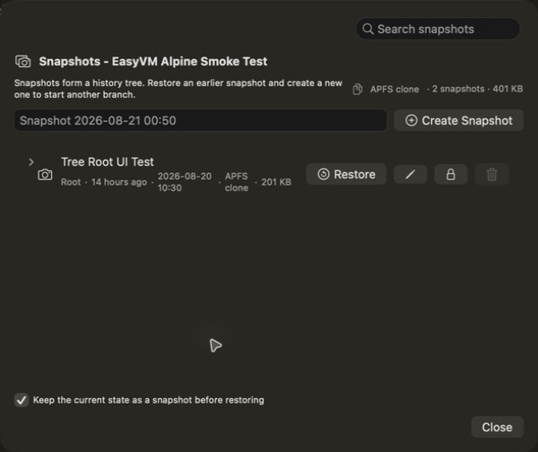
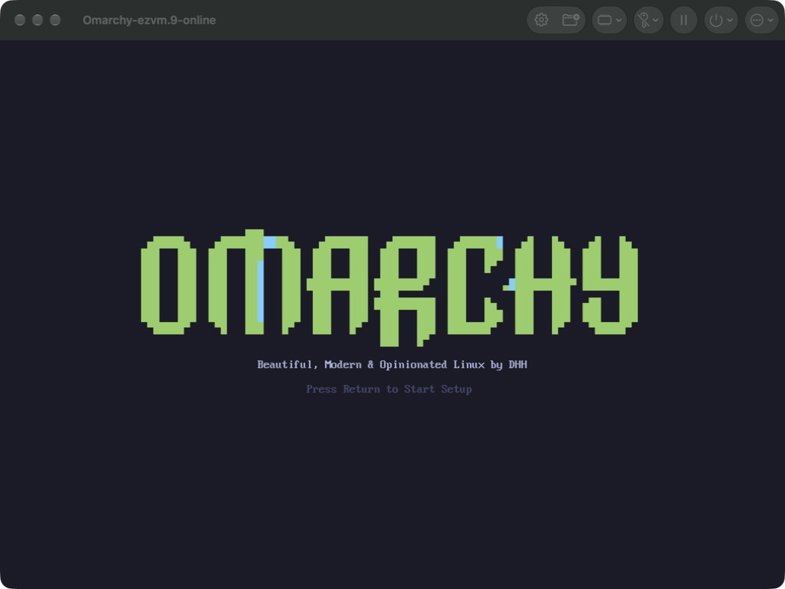

<p align="center">
  
</p>

# RiftVM

**Virtual machines, made easy — a focused native app for Apple silicon Macs.**

[](https://support.apple.com/macos)
[](https://support.apple.com/en-us/116943)
[](LICENSE)



## Install RiftVM

On an Apple silicon Mac running **macOS 27 or later**, install the signed
and notarized app with Homebrew:

```bash
brew install --cask riftvm/tap/riftvm
```

RiftVM is one application with focused Omarchy and macOS workspace journeys.
An Omarchy workspace downloads and verifies the pinned Factory image, creates
its own writable disk and machine identity, and provides owner setup, dynamic
display, shared folders, clipboard, notifications, and focus-scoped input.
macOS workspaces use Apple's native restore-image path and do not depend on the
Linux guest agent.

RiftVM uses Apple's [`Virtualization.framework`](https://developer.apple.com/documentation/virtualization) to deliver two focused experiences: native macOS virtual machines and a deeply integrated Omarchy workspace.

> **Project status:** RiftVM is Developer ID-signed and Apple-notarized. VM software can affect large disk images, so keep backups of important guests.

## Screenshots

<p align="center">
  
  
</p>

## What it does

- Creates and runs macOS virtual machines from a local IPSW, a selectable macOS version, or Apple's latest supported restore image
- Creates and runs a verified, preinstalled Omarchy workspace with first-run owner setup
- Stores machines in `~/RiftVM Virtual Machines` by default; any other location can still be chosen
- Keeps downloaded system images in a shared store and reuses them when creating more machines
- Takes, restores, and deletes snapshots of a stopped machine (APFS copy-on-write clones)
- Clones stopped machines with a new hardware identity and imports/exports checksum-verified `.riftvmexport` packages
- Integrates with an optional authenticated Linux guest agent for readiness, IP reporting, SSH links, safe file transfer, and explicit shutdown/restart commands
- Installs an `riftvm` CLI with versioned JSON inspection, validation, diagnostics, and headless start/status/stop commands
- Configures CPU, memory, display, storage, networking, audio, pointing devices, and shared directories
- Accelerates Linux desktops with a native Custom Virtio GPU backed by
  VirGLRenderer and ANGLE/Metal; macOS guests retain Apple native graphics and
  Linux guests fall back to Apple Virtio if Custom VirGL can't start
- Uses Apple's native virtualization stack—no bundled hypervisor or cross-architecture emulation
- Keeps the app and its VM configuration format intentionally small

## Requirements

- An Apple silicon Mac
- macOS 27 or later
- A supported macOS restore image, or the verified Omarchy image downloaded by RiftVM

## Installation details

Install the signed and notarized release from the RiftVM Homebrew tap:

```sh
brew install --cask riftvm/tap/riftvm
```

Or download the archive from [GitHub Releases](https://github.com/riftvm/riftvm/releases/latest).

Open RiftVM and choose **Create Omarchy Workspace** or **Create macOS
Workspace**. Both journeys are part of the same signed application and release
archive. `scripts/install-omarchy.sh` remains a developer and recovery tool for
building an Omarchy workspace from the command line.



### Command line and headless mode

The Homebrew cask links `riftvm` into Homebrew's executable prefix. Every
command writes one schema-versioned JSON object and uses deterministic exit
codes, making it suitable for local scripts:

```sh
riftvm list
riftvm inspect "My Omarchy Workspace"
riftvm validate "/path/to/My VM.riftvm"
riftvm doctor
riftvm start "My Omarchy Workspace" --timeout 90
riftvm status "My Omarchy Workspace"
riftvm stop "My Omarchy Workspace" --timeout 30
riftvm install-image preinstalled-image.json --image disk.raw \
  --destination "$HOME/RiftVM Virtual Machines/My Omarchy Workspace.riftvm" --timeout 300
```

Use `--root /path/to/library` one or more times when machines are stored outside
`~/RiftVM Virtual Machines`. Headless mode runs the signed RiftVM virtualization
process without presenting a VM window. Stop first requests a guest shutdown
and uses a bounded force-stop fallback.

`install-image` imports a decoded, bootable ARM64 raw disk described by the
versioned [preinstalled-image manifest](docs/PREINSTALLED_IMAGE_MANIFEST.md).
Both the CLI and signed app verify its logical size and SHA-256, and interrupted
installation leaves no partial machine bundle.

## Build from source

1. Clone this repository.
2. Open `RiftVM/RiftVM.xcodeproj` in Xcode.
3. Select the **RiftVM** scheme and your Mac as the run destination.
4. Choose your own development team and bundle identifier if code signing requires it.
5. Build and run with <kbd>⌘R</kbd>.

The unified product architecture, migration boundaries, image policy, and
acceptance gates are documented in the
[RiftVM unified product plan](docs/RIFTVM_UNIFIED_PRODUCT_PLAN.md).

### Linux graphics backends

RiftVM selects the graphics backend at runtime:

| Host and guest | Graphics path |
| --- | --- |
| macOS 27+ host, Linux guest | Custom Virtio GPU → VirGLRenderer → ANGLE/Metal |
| macOS guest | Apple native Mac graphics path |

The Custom VirGL path supports zero-copy scanout presentation, display-clock
frame pacing, authenticated guest keyboard/wheel input, and guest-acknowledged
dynamic resolution for window and full-screen transitions. It intentionally
does not support Virtualization.framework machine-state save/restore: restoring
guest RAM alone cannot reconstruct VirGL renderer contexts and resources.
Stopped-VM file snapshots remain supported.

Implementation and validation details are in the
[Custom VirGL architecture notes](docs/CUSTOM_VIRGL_ARCHITECTURE.md),
[performance guide](docs/VIRGL_PERFORMANCE.md), and isolated
[prototype record](Experiments/VZVirtioGPUPrototype/README.md).

If a VM opens without a usable window, input appears only after pointer
movement, full screen is stretched, Command-to-Super shortcuts fail, setup
loops, or a release repeatedly asks for Keychain access, start with the
[troubleshooting guide](docs/TROUBLESHOOTING.md). It separates host display
problems, guest Agent/compositor problems, image compatibility, and release
signing problems so that one workaround does not hide a different failure.

The September 2026 clean-image acceptance run rebuilt and imported a 64 GiB
sparse Omarchy image, completed the entire first-run flow, reached Hyprland,
adapted the desktop to full screen, exercised Command-to-Super shortcuts and
continuous typing (including remotely synthesized Shift characters), verified
browser scrolling by hand, and confirmed guest NAT, DNS, TLS 1.3/HTTP/2, and
the real pacman update path. The deployment target is macOS 27; Linux guests
select Custom VirGL while retaining the Apple Virtio startup fallback.

## Guest images

### macOS

Pick a macOS version from the built-in list in the creation flow (or use the latest supported restore image), or select a compatible `.ipsw` restore image from disk. Apple publishes current restore images through `Virtualization.framework`; third-party indexes such as [ipsw.me](https://ipsw.me/product/Mac) can help locate older versions.

### Omarchy

Choose **Create Omarchy Workspace**. RiftVM downloads the pinned Factory release, verifies its signed manifest and image digest, creates a private writable disk and machine identity, then guides you through owner setup. Generic Linux distributions and custom ISO installation are intentionally outside RiftVM's product scope.

## Direction

RiftVM is not trying to replace UTM, VirtualBuddy, Tart, or Lima. Its direction is narrower:

1. Make VM creation, launch, stop, recovery, and error handling reliable.
2. Keep local macOS 27 tests, signed releases, Homebrew distribution,
   diagnostics, and configuration migration reproducible. Hosted CI can return
   when a genuine macOS 27 runner can execute the same GUI and VM gates.
3. Expose a small, local automation surface so scripts and AI agents can create, start, inspect, and discard isolated VMs safely.

The automation layer will remain local-first, explicit, and opt-in. RiftVM will not embed an AI model or require a cloud account. See the [refresh roadmap](docs/ROADMAP.md), [ecosystem research](docs/RESEARCH.md), and [Homebrew distribution plan](docs/HOMEBREW.md).

## Contributing

Issues and focused pull requests are welcome. During the refresh, reliability fixes, reproducible bug reports, tests, accessibility improvements, and documentation updates have priority over broad new features.

When reporting a VM problem, include the host macOS version, Mac model/chip, guest OS and image source, and the last operation performed. Do not attach VM disks or logs containing secrets.

## Community

- [GitHub Issues](https://github.com/riftvm/riftvm/issues) for bugs and focused feature requests
- [GitHub Issues](https://github.com/riftvm/riftvm/issues) for questions and design ideas
- [Discord](https://discord.gg/eGzEaP6TzR) for informal conversation

## License

RiftVM is available under the [MIT License](LICENSE).
