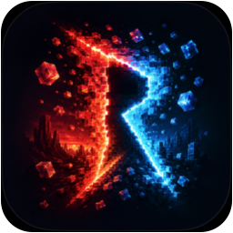

<p align="center">
  
</p>

# RiftVM

**Virtual machines, made easy — a focused native app for Apple silicon Macs.**

[](https://support.apple.com/macos)
[](https://support.apple.com/en-us/116943)
[](LICENSE)

## Install RiftVM

On an Apple silicon Mac running **macOS 27 or later**, install the signed
and notarized app with Homebrew:

```bash
brew install --cask riftvm/tap/riftvm
```

Create an **Omarchy workspace** from a verified preinstalled image, or a
**macOS virtual machine** from an Apple restore image. Both run locally using
Apple's [Virtualization.framework](https://developer.apple.com/documentation/virtualization).

Prefer a direct download? Get the signed and notarized app from
[GitHub Releases](https://github.com/riftvm/riftvm/releases/latest).

## Create your first workspace

1. Open RiftVM and choose **Create Omarchy Workspace** or **Create macOS Workspace**.
2. Choose a name, location, and hardware settings. The default location is `~/RiftVM Virtual Machines`; RiftVM remembers a custom location when you choose one.
3. Click **Create** to download and verify the required image, then start your workspace. Omarchy guides you through owner setup on first boot.

Each workspace has its own writable disk and machine identity. Downloaded
images are cached for reuse; Omarchy still needs a connection to verify its
release manifest when creating a workspace, even with a cached image.

## What it does

- Creates and runs macOS virtual machines from a local IPSW, a selectable macOS version, or Apple's latest supported restore image
- Creates and runs a verified, preinstalled Omarchy workspace with first-run owner setup
- Stores machines in `~/RiftVM Virtual Machines` by default; any other location can still be chosen
- Keeps downloaded system images in a shared store and reuses them when creating more machines
- Takes, restores, and deletes snapshots of a stopped machine
- Clones stopped machines with a new hardware identity and imports/exports checksum-verified `.riftvmexport` packages
- Integrates with an optional authenticated Linux guest agent for readiness, IP reporting, SSH links, safe file transfer, and explicit shutdown/restart commands
- Installs a `riftvm` CLI with versioned JSON inspection, validation, diagnostics, and headless start/status/stop commands
- Configures CPU, memory, display, storage, networking, audio, pointing devices, and shared directories
- Accelerates Linux desktops with a native Custom Virtio GPU backed by
  VirGLRenderer and ANGLE/Metal; macOS guests retain Apple native graphics and
  Linux guests fall back to Apple Virtio if Custom VirGL can't start
- Uses Apple's native virtualization stack—no bundled hypervisor or cross-architecture emulation
- Keeps the app and its VM configuration format intentionally small

## Requirements

- An Apple silicon Mac
- macOS 27 or later
- A supported macOS restore image, or the verified Omarchy image downloaded by RiftVM

## Limits to know

- Apple silicon and macOS 27 or later are required. Intel Macs and generic Linux ISO installation are outside the supported creation flow.
- Stop a machine before taking or restoring a file snapshot. Keep backups of important guests.
- Omarchy's Custom VirGL graphics do not support saving and restoring guest memory state. Stopped-machine file snapshots remain available.
- Share host folders deliberately: a guest with read-write access can change their contents.

For setup, display, input, and signing problems, see the
[troubleshooting guide](docs/TROUBLESHOOTING.md).

### Command line and headless mode

The Homebrew cask links `riftvm` into Homebrew's executable prefix. Every
command writes one schema-versioned JSON object and uses deterministic exit
codes, making it suitable for local scripts:

```sh
riftvm list
riftvm inspect "My Omarchy Workspace"
riftvm validate "/path/to/My VM.riftvm"
riftvm doctor
riftvm start "My Omarchy Workspace" --timeout 90
riftvm status "My Omarchy Workspace"
riftvm stop "My Omarchy Workspace" --timeout 30
riftvm install-image preinstalled-image.json --image disk.raw \
  --destination "$HOME/RiftVM Virtual Machines/My Omarchy Workspace.riftvm" --timeout 300
```

Use `--root /path/to/library` one or more times when machines are stored outside
`~/RiftVM Virtual Machines`. Headless mode runs the signed RiftVM virtualization
process without presenting a VM window. Stop first requests a guest shutdown
and uses a bounded force-stop fallback.

`install-image` imports a decoded, bootable ARM64 raw disk described by the
versioned [preinstalled-image manifest](docs/PREINSTALLED_IMAGE_MANIFEST.md).
Both the CLI and signed app verify its logical size and SHA-256, and interrupted
installation leaves no partial machine bundle.

## Build from source

1. Clone this repository.
2. Open `RiftVM/RiftVM.xcodeproj` in Xcode.
3. Select the **RiftVM** scheme and your Mac as the run destination.
4. Choose your own development team and bundle identifier if code signing requires it.
5. Build and run with <kbd>⌘R</kbd>.

See the [documentation index](docs/README.md) for troubleshooting, image formats,
guest integration, graphics architecture, and distribution details.

### Linux graphics backends

RiftVM selects the graphics backend at runtime:

| Host and guest | Graphics path |
| --- | --- |
| macOS 27+ host, Linux guest | Custom Virtio GPU → VirGLRenderer → ANGLE/Metal |
| macOS guest | Apple native Mac graphics path |

The Custom VirGL path supports zero-copy scanout presentation, display-clock
frame pacing, authenticated guest keyboard/wheel input, and guest-acknowledged
dynamic resolution for window and full-screen transitions. It intentionally
does not support Virtualization.framework machine-state save/restore: restoring
guest RAM alone cannot reconstruct VirGL renderer contexts and resources.
Stopped-VM file snapshots remain supported.

Implementation and validation details are in the
[Custom VirGL architecture notes](docs/CUSTOM_VIRGL_ARCHITECTURE.md),
[performance guide](docs/VIRGL_PERFORMANCE.md), and isolated
[prototype record](Experiments/VZVirtioGPUPrototype/README.md).

If a VM opens without a usable window, input appears only after pointer
movement, full screen is stretched, Command-to-Super shortcuts fail, setup
loops, or a release repeatedly asks for Keychain access, start with the
[troubleshooting guide](docs/TROUBLESHOOTING.md). It separates host display
problems, guest Agent/compositor problems, image compatibility, and release
signing problems so that one workaround does not hide a different failure.

## Guest images

### macOS

Pick a macOS version from the built-in list in the creation flow (or use the latest supported restore image), or select a compatible `.ipsw` restore image from disk. Apple publishes current restore images through `Virtualization.framework`; third-party indexes such as [ipsw.me](https://ipsw.me/product/Mac) can help locate older versions.

### Omarchy

Choose **Create Omarchy Workspace**. RiftVM downloads the pinned Factory release, verifies its signed manifest and image digest, creates a private writable disk and machine identity, then guides you through owner setup. Generic Linux distributions and custom ISO installation are intentionally outside RiftVM's product scope.

## Direction

RiftVM is not trying to replace UTM, VirtualBuddy, Tart, or Lima. Its direction is narrower:

1. Make VM creation, launch, stop, recovery, and error handling reliable.
2. Keep local macOS 27 tests, signed releases, Homebrew distribution,
   diagnostics, and configuration migration reproducible. Hosted CI can return
   when a genuine macOS 27 runner can execute the same GUI and VM gates.
3. Expose a small, local automation surface so scripts and AI agents can create, start, inspect, and discard isolated VMs safely.

The automation layer will remain local-first, explicit, and opt-in. RiftVM will not embed an AI model or require a cloud account. See the [documentation index](docs/README.md) for maintained technical references.

## Contributing

Issues and focused pull requests are welcome. Reliability fixes, reproducible bug reports, tests, accessibility improvements, and documentation updates are especially useful.

When reporting a VM problem, include the host macOS version, Mac model/chip, guest OS and image source, and the last operation performed. Do not attach VM disks or logs containing secrets.

## Community

- [GitHub Issues](https://github.com/riftvm/riftvm/issues) for bugs, questions, and focused feature requests
- [Discord](https://discord.gg/eGzEaP6TzR) for informal conversation

## License

RiftVM is available under the [MIT License](LICENSE).
